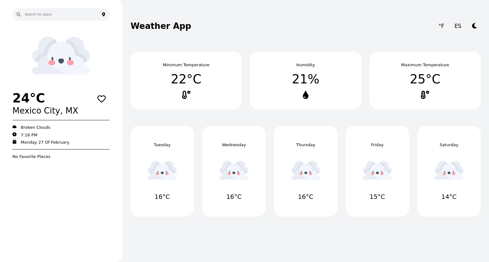
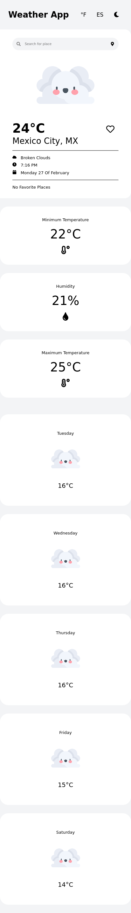

   
   <h1>Weather App</h1
      
   
Este proyecto fue desarrollado para poder buscar el clima en distintos países y regiones y poder guardarlos para así poder acceder a ellos de una manera más fácil.

   <a href="https://erik-weather-app.vercel.app/">Ver Sitio</a>

   <h2>Tecnologías</h2>
   
   
React, Next JS, CSS3 y Node JS

   <h2>Escritorio</h2>
   

   <h2>Celular</h2>
   

